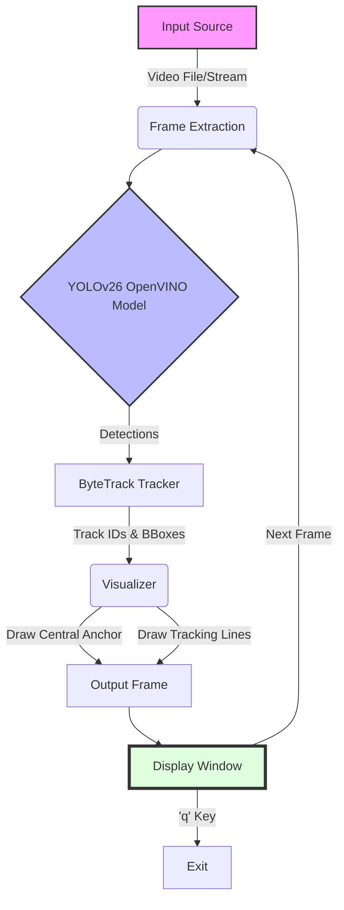

# Fall Detection System with YOLOv26 & OpenVINO

## Overview
This project implements a real-time Fall Detection and Person Tracking system using a **YOLOv26** model optimized with **OpenVINO**. It is designed to detect and track individuals in video feeds, providing visual feedback including tracking lines and center-point estimation. The system is particularly useful for safety monitoring in environments like warehouses or care facilities.

## System Workflow



## Features
- **Advanced Detection**: Utilizes the YOLOv26 architecture for high-accuracy object detection.
- **OpenVINO Optimization**: Leverages Intel's OpenVINO toolkit for accelerated inference on Intel hardware (CPU/GPU).
- **Real-time Tracking**: Implements `ByteTrack` for persistent object tracking across video frames.
- **Visual Analytics**: 
  - Draws a fixed central anchor point.
  - Renders tracking lines from the center to detected individuals.
  - Highlights object centers with distinct markers.
- **Video Support**: Capable of processing pre-recorded video files (e.g., `falls.mp4`).

## Prerequisites
Ensure you have the following installed:
- Python 3.8+
- [OpenVINO Toolkit](https://docs.openvino.ai/)
- [Ultralytics YOLO](https://docs.ultralytics.com/)
- OpenCV

## Installation

1.  **Clone the repository:**
    ```bash
    git clone https://github.com/RajuKonakalla/Fall_Detection_CV.git
    cd Fall_Detection_CV
    ```

2.  **Install dependencies:**
    ```bash
    pip install ultralytics opencv-python openvino
    ```

## Usage

1.  **Prepare your video source:**
    Ensure the target video file (default: `falls.mp4`) is present in the project root.

2.  **Run the detection script:**
    ```bash
    python run.py
    ```

3.  **Controls:**
    - The output window "Warehouse Tracking System" will appear.
    - Press `q` to quit the application.

## Project Structure

- **`run.py`**: The main entry point script. Handles model loading, video processing, tracking logic, and visualization.
- **`yolo266_openvino_model/`**: Contains the OpenVINO optimized model files (`.xml`, `.bin`, `.yaml`).
- **`yolo266.pt`**: Source PyTorch model file.
- **Video Samples**:
  - `falls.mp4`: Default input video for testing.
  - `demo.mp4`, `school.mp4`, etc.: Additional test footage.

## Configuration
 You can modify `run.py` to change:
- **Model Path**: Update `model = YOLO('path/to/model')` if using a different model.
- **Input Source**: Change `cap = cv2.VideoCapture("your_video.mp4")` and `model.track(source="your_video.mp4")`.
- **Inference Device**: Set `device="intel:gpu"` or `device="cpu"` in the `model.track()` call based on your hardware.

## Authors
- **Raju Konakalla**
- **Syed shyni**
