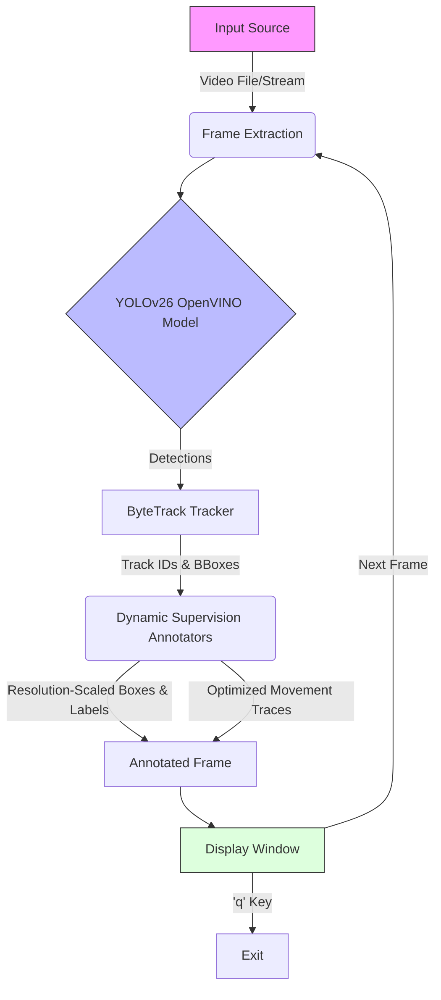

---

   

# Fall Detection System

**Real-time surveillance and anomaly detection utilizing YOLOv26 architecture and OpenVINO optimization.**


## Table of Contents
- [About the Project](#about-the-project)
- [System Architecture](#system-architecture)
- [Key Features](#key-features)
- [Getting Started](#getting-started)
- [Usage](#usage)
- [Authors](#authors)

## About the Project

This repository hosts a high-performance computer vision solution designed for the automated detection of falls and tracking of individuals in real-time video feeds. Engineered for safety-critical environments such as warehouses and healthcare facilities, the system leverages the **YOLOv26** object detection model, heavily optimized with **Intel OpenVINO** for edge deployment.

The core functionality integrates a robust **ByteTrack**-based module for persistent object tracking, ensuring individuals are monitored consistently even in complex scenes.

## System Architecture

The following diagram illustrates the data processing pipeline, from video ingestion to visual output.



## Key Features

- **High-Fidelity Detection**: Deploys the YOLOv26 architecture for state-of-the-art accuracy in person detection.
- **Inference Optimization**: Fully optimized using the OpenVINO toolkit, enabling efficient inference on Intel CPUs and GPUs.
- **Robust Tracking**: Implements a customized `ByteTrackTracker` to maintain consistent identity association across temporal sequences.
- **Responsive Visual Analytics**:
  - **Resolution-Aware Scaling**: Automatically scaling text thickness, padding, and box thickness dynamically over video dimension to keep visuals clean under any source resolution.
  - **High-Visibility Fall Alerts**: Dynamically detects the 'fall' class and highlights it with a thick, bright red bounding box and a red label header for immediate anomaly notification.
  - **Optimized Tracing**: Employs an optimized `sv.TraceAnnotator` enforcing short trace lengths (`trace_length=20`) to create a clear, clutter-free trail of movements.
  - **Categorical Color Coding**: Dynamically allocates distinct, high-contrast colors to individual tracking IDs from a curated palette, enhancing visibility in crowded scenarios.
- **Versatile Input Handling**: Supports processing of both live streams and pre-recorded high-definition video footage.

## Getting Started

Follow these instructions to set up the project locally for development and testing purposes.

### Prerequisites

Ensure the following runtimes and libraries are installed on your system:

- Python 3.8 or higher
- Intel OpenVINO Toolkit
- Ultralytics YOLO
- Supervision
- OpenCV (cv2)

### Installation

1.  **Clone the repository**
    ```bash
    git clone https://github.com/RajuKonakalla/Fall_Detection_CV.git
    cd Fall_Detection_CV
    ```

2.  **Install dependencies**
    ```bash
    pip install ultralytics opencv-python openvino supervision
    ```

## Usage

1.  **Configure Input**
    Place your target video file in the project root. The default configuration processes `ppt5.mp4` by default. To use a different file, modify the `cv2.VideoCapture()` source path in `run.py`.

2.  **Execute the System**
    ```bash
    python run.py
    ```

3.  **Operation**
    The "Warehouse Tracking System" window will launch, displaying the processed feed with overlay analytics in a 1024x576 resized window. Press `q` to terminate the application.

## Authors

- **Raju Konakalla**
- **Syed shyni**
